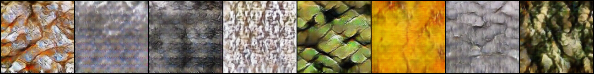
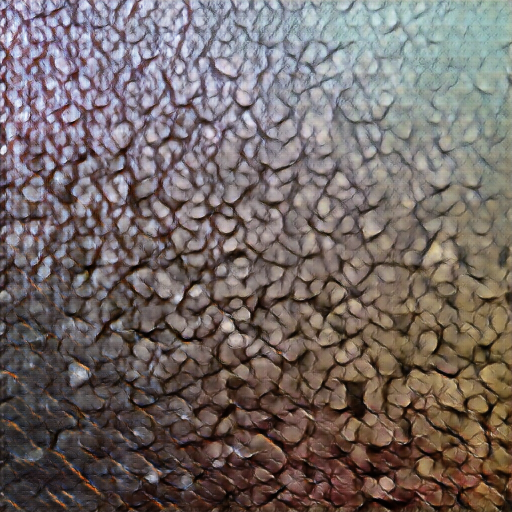
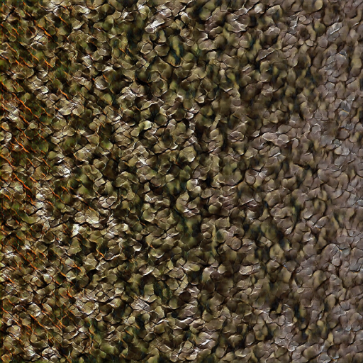

Pytorch implementation of PSGAN.
  
Paper  
- https://arxiv.org/abs/1705.06566  
  
Author's code  
- https://github.com/zalandoresearch/psgan  
  
# Samples of Training Result
trained on DTD scaly.  
  
same global noise.
  
  
tiled.  
  
  
interpolation.  
4 corners  
  
  
left to right.  
  
  